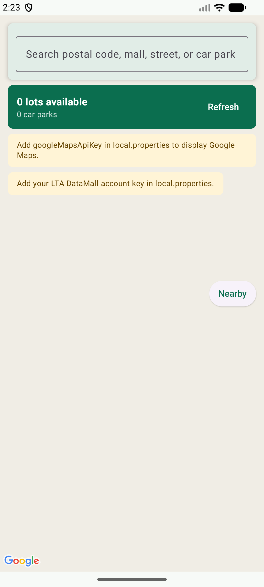

<div align="center">

# SG Carpark Android

[](https://kotlinlang.org/)
[](https://developer.android.com/)
[](https://developer.android.com/compose)
[](https://developers.google.com/maps/documentation/android-sdk)

**Native Android car park availability map for Singapore drivers.**

[Report Bug](https://github.com/alfredang/sgbusapp_android/issues) | [Request Feature](https://github.com/alfredang/sgbusapp_android/issues)

</div>

## Screenshot



## About

SG Carpark Android is a Kotlin and Jetpack Compose app for finding Singapore car parks and checking live lot availability. It combines LTA DataMall car park availability with Google Maps, place search, current-location lookup, and quick navigation handoff to Google Maps.

## Features

- Live car park availability from LTA DataMall `CarParkAvailabilityv2`.
- Google Maps interface with compass, current-location support, and marker callouts.
- Search by postal code, mall, street, place, car park name, area, or agency.
- Nearby action to select the nearest available car park using runtime location permission.
- Availability overview with total available lots, visible car park count, and refresh state.
- Bottom detail panel with available lots, agency, lot type, distance, and directions.

## Tech Stack

| Layer | Technology |
| --- | --- |
| Language | Kotlin 2.1.0 |
| UI | Jetpack Compose, Material 3 |
| Maps | Google Maps Compose, Google Maps Android SDK |
| Location | Google Play Services Fused Location Provider |
| Networking | OkHttp |
| Serialization | Kotlinx Serialization |
| Data Source | LTA DataMall `CarParkAvailabilityv2` |
| Build | Gradle, Android Gradle Plugin 8.13.0 |
| Platform | Android 8.0+ / API 26+ |

## Architecture

```text
+----------------------------------------------+
| MainActivity / Jetpack Compose UI            |
| Search panel, map, overview, detail panel    |
+----------------------+-----------------------+
                       | observes StateFlow
+----------------------v-----------------------+
| CarparkMapViewModel                          |
| Loading, search, selection, location state   |
+-------+-----------------------+--------------+
        |                       |
+-------v------------+  +-------v--------------+
| LTADataMallClient  |  | Search/Location      |
| Availability API   |  | Geocoder + Fused GPS |
+-------+------------+  +-------+--------------+
        |                       |
+-------v-----------------------v--------------+
| LTA DataMall, Android Geocoder, Google Maps  |
+----------------------------------------------+
```

## Project Structure

```text
.
|-- app/
|   |-- build.gradle.kts
|   `-- src/main/
|       |-- AndroidManifest.xml
|       |-- java/com/alfredang/sgcarpark/
|       |   |-- MainActivity.kt
|       |   |-- CarparkMapViewModel.kt
|       |   |-- CarparkModels.kt
|       |   |-- LTADataMallClient.kt
|       |   |-- LocationService.kt
|       |   `-- SearchService.kt
|       `-- res/
|-- gradle/
|-- local.properties.example
|-- screenshot.png
`-- settings.gradle.kts
```

## Getting Started

### Prerequisites

- Android Studio with JDK 17.
- Android SDK with compile SDK 36 installed.
- LTA DataMall account key.
- Google Maps Android API key.

### Configure

Copy the example local configuration:

```bash
cp local.properties.example local.properties
```

Set the SDK path and API keys:

```properties
sdk.dir=/Users/alfredang/Library/Android/sdk
ltaAccountKey=your_lta_datamall_account_key
googleMapsApiKey=your_google_maps_android_api_key
```

`local.properties` is ignored by Git. API keys are injected into `BuildConfig` and the Android manifest during the Gradle build.

### Build

```bash
JAVA_HOME="/Applications/Android Studio.app/Contents/jbr/Contents/Home" ./gradlew :app:assembleDebug
```

### Install On A Connected Device

```bash
adb install -r app/build/outputs/apk/debug/app-debug.apk
adb shell am start -n com.alfredang.sgcarpark/.MainActivity
```

## Configuration Notes

The app can launch without API keys, but the map and live availability feed require valid `googleMapsApiKey` and `ltaAccountKey` values. The screenshot in this repository was captured from the local debug build before keys were configured.

## Contributing

1. Fork the repository.
2. Create a feature branch.
3. Commit focused changes with a clear message.
4. Open a pull request with screenshots for UI changes.

## Acknowledgements

- Singapore LTA DataMall for car park availability data.
- Google Maps Platform for map rendering and navigation handoff.
- Android Jetpack Compose and Material 3 for the native UI stack.
